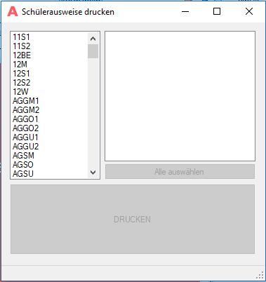
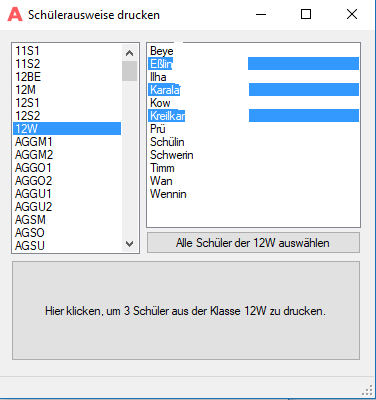

# Schuelerausweise drucken #

Mit ***Schuelerausweis*** können Schülerausweise im Scheckkartenformat auf einem **Magicard Rio Pro (V2)**  gedruckt werden. 
Die Klassen und die darin enthaltenen Schülerinnen und Schüler werden mit ***Schuelerausweis*** aus Atlantis ausgelesen.

## Hauptseite ##

Auf der Hauptseite kann eine oder mehrere Klassen gewählt werden. Ohne Auswahl bleibt der Button ***DRUCKEN*** ausgegraut.

## Auswahl ##

Aus mehreren Klassen können alle oder einzelne Schüler gewählt werden. Der ***Drucken***-Button zeigt, welche Aufträge anliegen.

